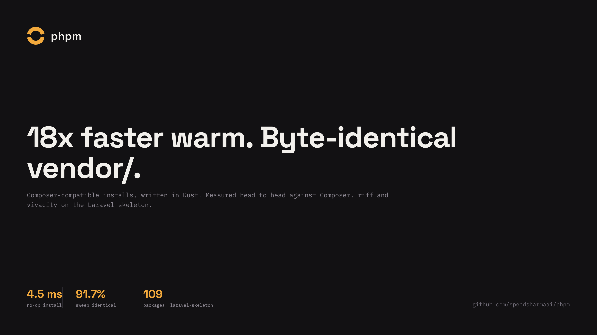

<p align="center">
  <picture>
    <source media="(prefers-color-scheme: dark)" srcset="docs/design/logo/mark-dark.svg">
    
  </picture>
</p>

<h1 align="center">phpm</h1>

<p align="center">
  <a href="https://github.com/speedsharmaai/phpm/actions/workflows/ci.yml"></a>
  <a href="https://sonarcloud.io/summary/new_code?id=speedsharmaai_phpm"></a>
  <a href="https://sonarcloud.io/summary/new_code?id=speedsharmaai_phpm"></a>
  <a href="https://scorecard.dev/viewer/?uri=github.com/speedsharmaai/phpm"></a>
  <a href="#licence"></a>
</p>

<p align="center">
  An extremely fast, Composer-compatible PHP installer, written in Rust. It reads
  your <code>composer.json</code> and <code>composer.lock</code> unchanged and writes the same
  <code>vendor/</code>, byte for byte, in a fraction of the time on every install that is
  not bound by the network.
</p>

<p align="center">
  <a href="https://speedsharmaai.github.io/phpm/">speedsharmaai.github.io/phpm</a>
</p>

<p align="center">
  
</p>

> **Early, built in the open.** `phpm install` is byte-identical to Composer
> on 98.1% of a 312-project nightly sweep, and its warm installs beat
> Composer's on every project measured on Linux and macOS. **Windows isn't
> supported yet** ([open issues](https://github.com/speedsharmaai/phpm/issues?q=is%3Aissue+is%3Aopen+label%3Awindows),
> help welcome). It installs from a lockfile only: no `update` or `require`
> yet. Every phase, decision and benchmark behind those numbers
> is public; start at [phases](phases/README.md).

<p align="center">
  <a href="#why-phpm">Why phpm</a> ·
  <a href="#benchmarks">Benchmarks</a> ·
  <a href="#compatibility">Compatibility</a> ·
  <a href="#installation">Installation</a> ·
  <a href="#usage">Usage</a> ·
  <a href="#how-it-works">How it works</a> ·
  <a href="#roadmap">Roadmap</a> ·
  <a href="#contributing">Contributing</a> ·
  <a href="#licence">Licence</a>
</p>

## Why phpm

Composer is good: a lockfile, parallel downloads, one blessed registry, a
respected maintainer team. The question was never "is Composer slow" — it is
"where is it slow enough that someone would install a second tool". Three
answers, in order of how much they matter:

1. **It never breaks a project.** Every competitor either refuses plugins,
   emulates a few, or breaks silently. phpm installs natively when it can
   prove the result is identical to Composer's, and hands the rest to real
   Composer when it cannot — `--explain` says which. A user should never be
   worse off for having tried it.
2. **Compatibility is published, not claimed.** A nightly sweep diffs phpm's
   `vendor/` against Composer's across hundreds of real projects and
   publishes the number, the way Ruff published ">99.9% Black-compatible".
   See [Compatibility](#compatibility).
3. **It is built for where installs multiply now.** Agents run installs in
   CI, in containers, and in parallel git worktrees, each wanting its own
   `vendor/`. With a shared store, a new worktree's `vendor/` costs a
   fraction of a second and almost no disk — see
   [the worktree recipe](docs/agent-worktrees.md) and
   [the Docker pattern](docs/docker.md) for a PHP-free build stage.

Full rationale — why Composer itself is good, how phpm earns (or mostly
doesn't), where the first users come from — is written out in
[why phpm](docs/why-phpm.md), along with the project's hard rules.

## Benchmarks

Laravel skeleton, 109 packages, M1 Pro, APFS, Composer 2.10.3, hyperfine,
every tool measured in the same session
([raw results](bench/results/2026-10-01-phase-02-close/),
[progress](phases/phase-02-parity-core/progress.md)):

| Tool | Cold (median of 8) | Warm install | No-op | `vendor/` vs Composer |
|---|---|---|---|---|
| Composer 2.10.3 | 21.08 s | 4.179 s | 1.606 s | reference |
| riff 0.0.7 | 13.17 s | 2.486 s | 1.514 s | 4 files differ |
| viv 0.20.0 | not run | 2.215 s | 8.8 ms | every file mode differs |
| vivacity 0.19.1 | 14.21 s | 684 ms | 470 ms | identical |
| **phpm** | **8.67 s** | **222 ms** | **4.5 ms** | **identical** |

Cold is network-bound and noisy from here (India, home broadband), so it
comes from a separate interleaved run, 8 rounds
([cold results](bench/results/2026-10-01-cold-interleaved/)). On the ytmate
fixture phpm's cold median is 11.65 s against riff's 13.19 s, a tie within
the noise: the time is one 6.9 MB archive every tool waits for.

With the skeleton's scripts on (`package:discover`, a PHP callable, so that
event goes through real Composer) and the malware filter checked, phpm
installs warm in 0.87 s against Composer's 4.57 s (5.3x; 5.9x on a quieter
rerun). On Linux (GitHub `ubuntu-latest`, ext4) phpm was 14x faster than
Composer warm and 633x on a no-op at the Phase 01 gate.

Real apps with their own scripts and plugins on, same machine
([progress](phases/phase-04-plugin-adapters/progress.md),
[raw results](bench/results/2026-10-01-phase-04-close/)):

| Fixture | Composer warm | phpm warm | Speed-up | Composer no-op | phpm no-op | Speed-up |
|---|---|---|---|---|---|---|
| Bedrock (WordPress) | 4.496 s | **319 ms** | **14.1x** | 1.204 s | **4.7 ms** | **256x** |
| drupal/recommended-project | 15.119 s | **1.973 s** | **7.7x** | 1.260 s | **5.4 ms** | **233x** |

### Real-world apps, GitHub runners

40 real apps, 38 of the largest open-source PHP apps that commit a lock
plus two of the author's own, each installed cold, warm and no-op by Composer and by phpm on `ubuntu-latest`,
`macos-latest` and `windows-latest`
([full page](https://speedsharmaai.github.io/phpm/bench/),
[progress](phases/phase-05-real-world-benchmarks/progress.md),
[raw results](bench-real/results/2026-10-02-run-37001206387.json)). Median
warm speed-up 9.4x on Linux, 18.6x on macOS, 1.6x on Windows; no-op
344-501x; `vendor/` identical on 39 of 40 projects on Linux and macOS, 35
of 39 on Windows (PrestaShop can't be copied there). On Windows, three
projects install slower warm with phpm than with Composer; Windows isn't
supported yet ([issues](https://github.com/speedsharmaai/phpm/issues?q=is%3Aissue+is%3Aopen+label%3Awindows)).
The one Linux and macOS difference, Grav, is a single line: the APCu prefix
Composer randomises on every autoload dump
([#122](https://github.com/speedsharmaai/phpm/issues/122)).

Top 10 by warm speed-up, `ubuntu-latest`, identical `vendor/` only:

| Project | Stars | Packages | Composer warm | phpm warm | Speed-up |
|---|---|---|---|---|---|
| [roots/bedrock](https://github.com/roots/bedrock) | 6575 | 73 | 3.110 s | 0.111 s | 27.9x |
| [PrestaShop/PrestaShop](https://github.com/PrestaShop/PrestaShop) | 9225 | 283 | 3.381 s | 0.258 s | 13.1x |
| [kimai/kimai](https://github.com/kimai/kimai) | 5054 | 197 | 4.477 s | 0.367 s | 12.2x |
| [monicahq/monica](https://github.com/monicahq/monica) | 25388 | 241 | 4.484 s | 0.390 s | 11.5x |
| [drupal/drupal](https://github.com/drupal/drupal) | 4289 | 145 | 1.908 s | 0.169 s | 11.3x |
| [crater-invoice-inc/crater](https://github.com/crater-invoice-inc/crater) | 8350 | 167 | 3.200 s | 0.285 s | 11.2x |
| [bagisto/bagisto](https://github.com/bagisto/bagisto) | 28196 | 220 | 5.106 s | 0.484 s | 10.6x |
| [pixelfed/pixelfed](https://github.com/pixelfed/pixelfed) | 7116 | 201 | 3.468 s | 0.337 s | 10.3x |
| [humhub/humhub](https://github.com/humhub/humhub) | 6746 | 257 | 3.167 s | 0.309 s | 10.3x |
| [laravel/laravel](https://github.com/laravel/laravel) | 85049 | 109 | 2.137 s | 0.208 s | 10.3x |

Generated by `bench-real readme-table` from the run's `results.json`, not
typed. Ten git worktrees of the Laravel skeleton install 5.8x faster on
Linux using 4.9x less disk. A whole CI job (install plus a lint pass) gets
only 1.35x faster at the median on Linux, because the install is a small
part of the job.

<details>
<summary>Where the warm-install time actually goes</summary>

Measured on an M1 Pro, Composer 2.10.3, fresh Laravel skeleton, 109 packages:

| Step | Composer | Floor measured | Where the time goes |
|---|---|---|---|
| cold install | 12-16 s | network | downloading 17 MB of zips |
| warm install | 4.1-4.4 s | **0.14-0.24 s** | re-unzipping 8,860 files from the cache on every install |
| no-op install | 1.6 s | milliseconds | PHP boot, platform solve, filter-list revalidation |
| autoload dump | ~0.9 s | ~0.1 s | single-threaded class scanning |

The floor is `clonefile()` of pre-extracted package directories from a global
store, one syscall per package — uv's design, applied to PHP. See
[benchmarks](docs/research/benchmarks-2026-10-01.md).

</details>

## Compatibility

A nightly sweep installs phpm and Composer side by side across 330 pinned
open-source PHP projects and diffs `vendor/` byte for byte, modes included —
[live results and methodology](https://speedsharmaai.github.io/phpm/sweep/).

| Mode | Identical | Ratio | Gate |
|---|---|---|---|
| Plugins and scripts off | 306 / 312 installable | **98.1%** | 95% — **passed** |
| Plugins and scripts on (Composer fallback included) | 267 / 281 installable | **95.0%** | — |
| Windows, plugins and scripts off | 18 / 19 installable | **94.7%** | — |

The sweep is also how real bugs get found before users hit them: it caught a
case where, on filesystems without copy-on-write cloning (most Linux
setups), a plugin writing into a hard-linked file could corrupt the shared
package store for every later install. phpm now copies instead of
hard-linking whenever scripts or plugins will run. Remaining gaps are filed
on the repo and are mostly niche (committed `vendor/` directories,
source-only packages with no dist).

`vendor/` is also byte-identical, bytes and file modes, on every one of the
project's own pinned fixtures (Laravel, Symfony demo, Monica, Bedrock,
drupal/recommended-project, and two production apps), including the
optimised class map. Bedrock and drupal/recommended-project install fully
natively — no Composer fallback for any step.

## Installation

Prebuilt binaries for macOS (arm64, x86_64) and Linux (arm64, x86_64,
static musl, any distro) are on every
[GitHub release](https://github.com/speedsharmaai/phpm/releases), with
build provenance attestations (`gh attestation verify <file> -R speedsharmaai/phpm`).

macOS and Linux:

```sh
curl -LsSf https://github.com/speedsharmaai/phpm/releases/latest/download/phpm-installer.sh | sh
```

Homebrew:

```sh
brew install speedsharmaai/phpm/phpm
```

npm (downloads the matching release binary on install; every run then pays
Node's startup, about 40 ms, so a no-op is ~45 ms instead of ~5 ms):

```sh
npm install -g phpm
```

From source, with Rust 1.96 or newer:

```sh
cargo install --locked --git https://github.com/speedsharmaai/phpm --tag v0.1.0 phpm
```

The installers put `phpm` in `~/.cargo/bin`. PHP, and Composer for anything
phpm hands back to it, still need to be installed.

**Windows isn't supported yet.** The release has a Windows binary and a
PowerShell installer, and both install fine, but on Windows phpm is only
1.6x faster than Composer at the median, slower on some projects, and not
identical on others. The known gaps are filed as
[issues labelled `windows`](https://github.com/speedsharmaai/phpm/issues?q=is%3Aissue+is%3Aopen+label%3Awindows);
help with any of them is welcome.

## Usage

```sh
cd /path/to/your/php/project
phpm install --explain
```

`--explain` prints, per package, whether it was installed natively or handed
to Composer and why. Plain `phpm install` otherwise behaves like
`composer install`: `--no-dev`, `--no-scripts`, `--no-plugins`,
`--optimize-autoloader` / `-o`, `--classmap-authoritative` / `-a` all work.

## How it works

composer.json and composer.lock are parsed unchanged. Packages are fetched
once into a global, content-addressed store, then placed into each
project's `vendor/` with a single `clonefile()`/reflink/hardlink per package
instead of re-extracting a zip. `installed.json`, `installed.php`, bin
proxies and the autoloader (including the optimized class map) are
regenerated to match Composer's output byte for byte. Anything phpm cannot
reproduce exactly — most plugins, PHP-callable scripts — is hooked through to
a real `composer` install for just that step. Full architecture:
[topology](docs/arch/topology.md) · [decisions](docs/decisions/README.md).

<details>
<summary>Stack</summary>

| Concern | Choice | Why |
|---|---|---|
| Language | Rust | single static binary, no PHP needed for the fast path; same as uv, Ruff, Mago |
| Async I/O | tokio + reqwest (rustls, HTTP/2) | bounded parallel downloads |
| Extraction | `zip` crate on rayon, in-memory buffers | PHP packages are small; streaming unzip only if profiling asks for it |
| Store | content-addressed by `(name, dist.reference)`, append-only, atomic rename | concurrent-safe, shared across projects and worktrees |
| Linking | `libc::clonefile` per package dir (macOS), FICLONE/hardlink (Linux), hardlink (Windows), copy fallback | measured 0.14 s for 109 packages vs 2.6 s of unzip |
| JSON | serde_json + a byte-exact PHP `json_encode` writer | installed.json and content-hash must match PHP's bytes |
| PHP output | a `var_export`-compatible writer | autoload_static.php and installed.php |
| Class scanning | `mago-syntax` lexer, results cached per file in the store | files in the store never change, so warm installs skip scanning |
| Platform | run `php` once, cache the answer | versions, extensions, lib versions |
| Resolver (Phase 07) | `pubgrub` | uv's resolver; better conflict messages than a SAT port |
| Distribution | cargo-dist: GitHub Releases, curl installer, Homebrew, npm wrapper; plus a Packagist wrapper for setup-php | every channel PHP developers already use |
| Benchmarks | hyperfine, JSON output committed | reproducible or it did not happen |

</details>

<details>
<summary>Repository layout</summary>

```text
crates/
  phpm            the binary
  phpm-lock       composer.json / composer.lock, installed.json, installed.php
  phpm-php        byte-exact PHP json_encode and var_export writers
  phpm-store      fetch, global store, extraction, clonefile placement
  phpm-autoload   Composer's autoload files and class scanning
  phpm-diffvendor compare two vendor/ trees byte for byte, modes included
  phpm-testkit    test helpers
fixtures/         pinned lockfiles the gate is measured on
bench/results/    hyperfine JSON behind every published number
tools/bench/      hyperfine harness: Composer vs phpm vs other installers
```

</details>

## Roadmap

| Phase | What | State |
|---|---|---|
| 00 | Quality foundation: lints, hooks, CI on 3 OSes, coverage, CodeQL, Scorecard, Sonar | done |
| 01 | Spike: `phpm install`, byte-identical, benchmarked, gate | **passed** |
| 02 | Parity core: platform checks, auth, scripts, malware filter, Composer fallback, faster cold fetch | **done** |
| 03 | Compatibility sweep: nightly diff against Composer across 330 projects | **passed** — 98.1% identical, gate 95% |
| 04 | Plugin adapters: composer/installers, Drupal scaffold, symfony/runtime, phpstan installer, PHPCS installer, php-http/discovery | **done** |
| 05 | Real-world benchmarks: Composer vs phpm on the largest open-source PHP apps | **done** — warm 9.4x Linux, 18.6x macOS, 1.6x Windows ([page](https://speedsharmaai.github.io/phpm/bench/)) |
| 06 | Launch: release, Homebrew, setup-php, Docker, GitHub Action | in progress: test pre-release [v0.1.0-rc.2](https://github.com/speedsharmaai/phpm/releases/tag/v0.1.0-rc.2) built and its installers checked |
| 07 | Resolver: `update` and `require` | |

Full plan and the gate each phase had to pass: [phases](phases/README.md) ·
[decisions](docs/decisions/README.md) · [research](docs/research/).

## Contributing

```sh
just ci
```

runs every check CI runs — formatting, clippy, tests, coverage, supply-chain
and style gates — so issues surface before a PR does. See
[CONTRIBUTING](CONTRIBUTING.md).

## Licence

Licensed under either of [Apache-2.0](LICENSE-APACHE) or [MIT](LICENSE-MIT),
at your option.
